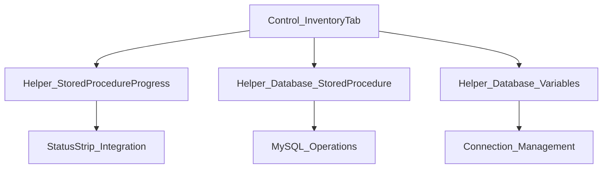
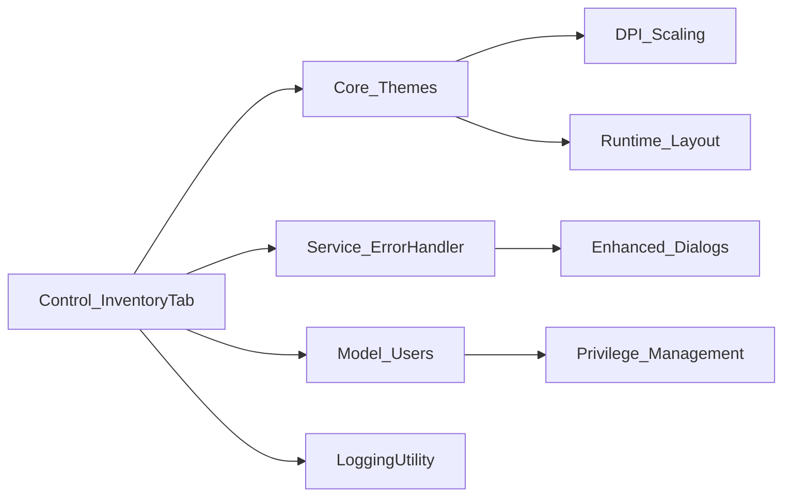
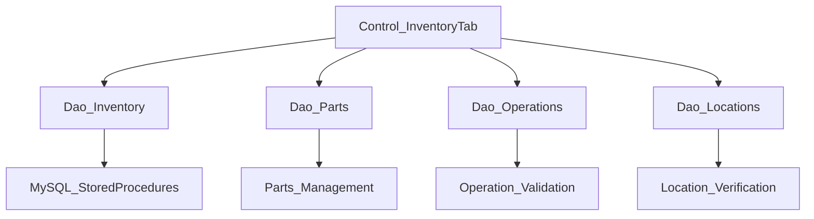
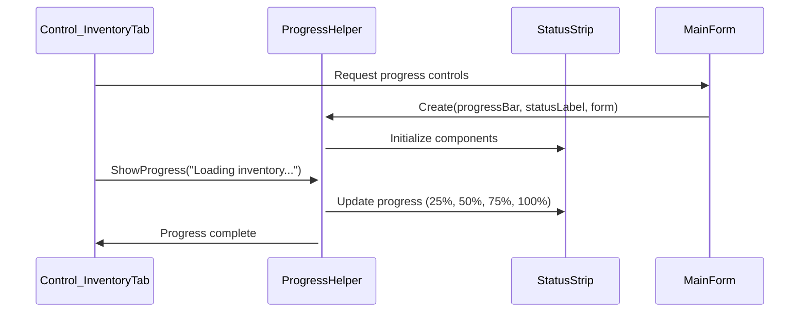
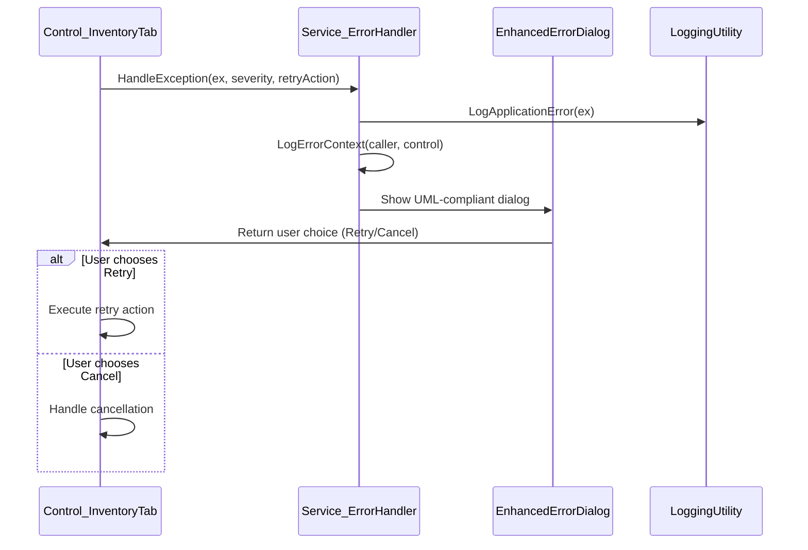

# Control_InventoryTab.cs - Comprehensive Dependency Chart

**File:** `Controls/MainForm/Control_InventoryTab.cs`  
**Type:** Primary Inventory UserControl  
**Last Updated:** 2025-01-27  
**Analysis Status:** ✅ COMPLETE - High Priority Analysis

## Overview
Control_InventoryTab serves as the primary interface for inventory entry operations in the MTM Inventory Application. This is the most frequently used control, providing comprehensive inventory management capabilities with sophisticated validation, progress tracking, and user experience optimizations.

## Core Dependencies

### **System Dependencies**
- **System** - Core system types and basic functionality
- **System.ComponentModel** - Component model and designer serialization
- **System.Data** - DataTable and database integration
- **System.Diagnostics** - Debug output and performance monitoring
- **System.Drawing** - Color management and visual styling
- **System.Windows.Forms** - WinForms controls and user interface
- **System.Threading.Tasks** - Asynchronous operations and database calls

### **Application Dependencies**

#### **Helper Integration**

#### **Core System Integration**

#### **Data Access Layer**

## Critical System Integrations

### **1. Progress System Architecture**

**Key Implementation:**
- **Helper_StoredProcedureProgress** provides standardized progress reporting
- **Color-coded feedback** - Green (success), Red (error), Yellow (warning)
- **Thread-safe updates** for asynchronous database operations
- **Progress percentage tracking** with descriptive status messages

### **2. Enhanced Error Handling Integration**

**Error Handling Strategy:**
- **Centralized Exception Management** - All exceptions route through Service_ErrorHandler
- **Contextual Error Information** - Automatic caller identification and control context
- **Retry Functionality** - Intelligent retry for transient database issues
- **User-Friendly Messages** - Plain English error explanations with recommended actions

## Performance Characteristics

### **Initialization Performance**
1. **Fast Startup** - Cached data reduces initial load time
2. **Progressive Loading** - UI responsive while data loads in background
3. **DPI Scaling** - Immediate application of appropriate scaling
4. **Theme Integration** - Consistent visual appearance from startup

### **Runtime Performance**
- **Asynchronous Operations** - Database calls don't block UI
- **Smart Caching** - Reduced database load through intelligent caching
- **Memory Management** - Proper disposal of resources and event handlers
- **Background Validation** - Non-blocking validation with immediate feedback

---

## Summary

Control_InventoryTab represents the cornerstone of user interaction in the MTM Inventory Application. The control successfully balances sophisticated functionality with ease of use, providing a robust foundation for high-volume inventory operations while maintaining excellent performance and user experience.

**Key Success Factors:**
- **User-Centric Design** - Intuitive interface optimized for repetitive operations
- **Performance Excellence** - Fast, responsive operation even with large datasets
- **Error Resilience** - Comprehensive error handling prevents data loss
- **Integration Excellence** - Seamless integration with all application systems
- **Scalability** - Architecture supports future enhancements and increased load