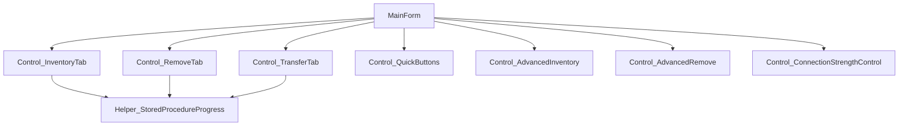
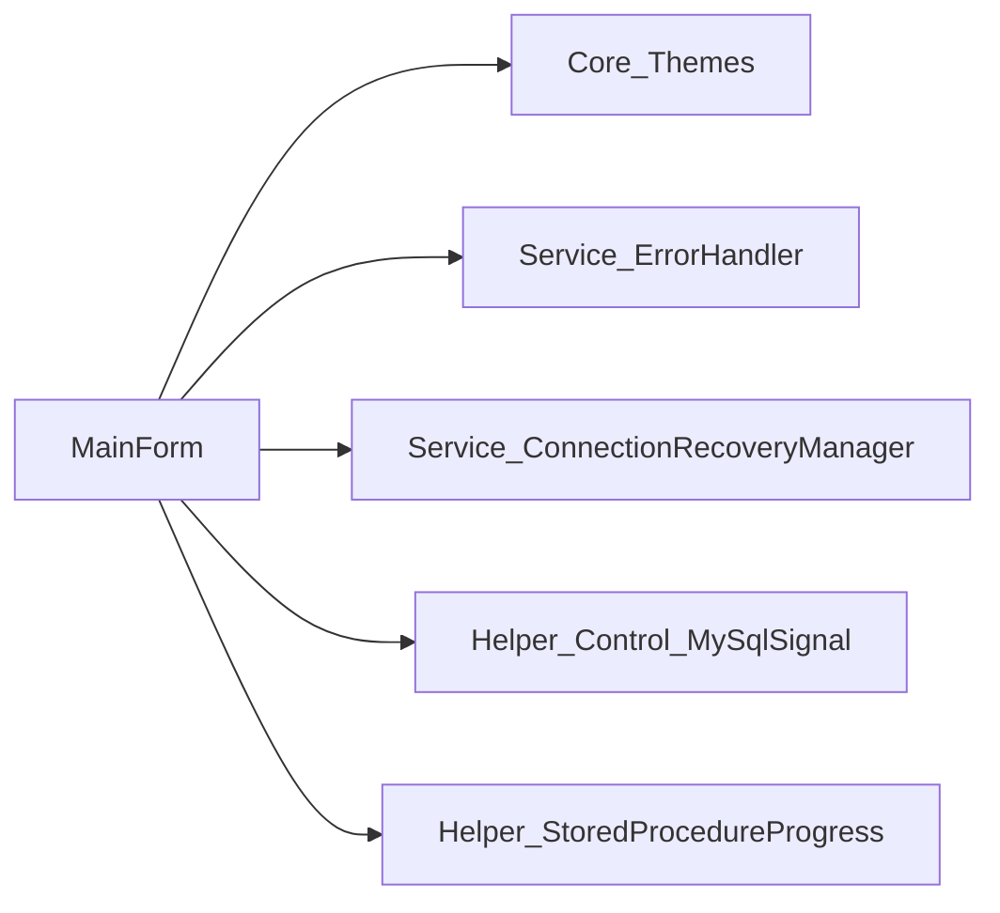
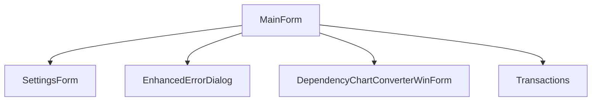
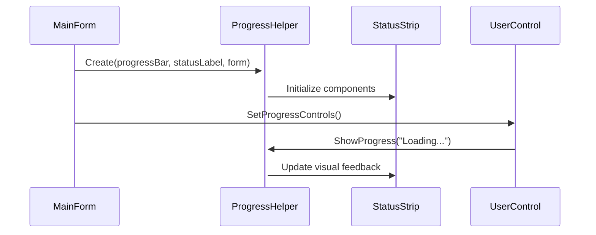
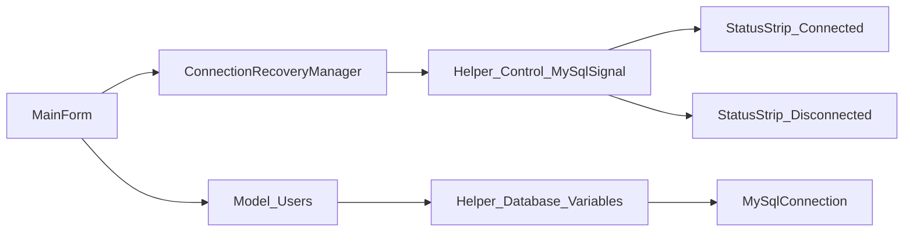
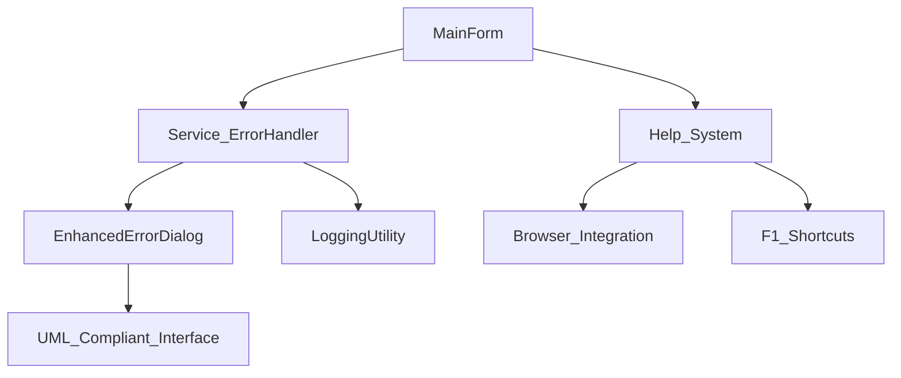
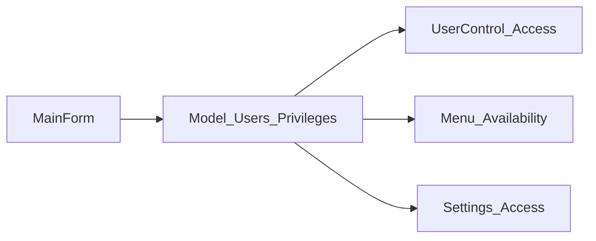

# MainForm.cs Dependency Chart

**File:** `Forms/MainForm/MainForm.cs`  
**Type:** Primary Application Form  
**Last Updated:** 2025-01-27  
**Analysis Status:** ✅ COMPLETE - High Priority Analysis

## Overview
MainForm serves as the central hub of the MTM Inventory Application, orchestrating all major user interfaces, progress controls, database connections, and system integrations. This is the most critical form in the application architecture.

## Core Dependencies

### **System Dependencies**
- **System.ComponentModel** - Designer serialization and component management
- **System.Diagnostics** - Debug logging and performance monitoring  
- **System.Reflection** - Assembly version information for About dialog
- **Microsoft.Win32** - Registry operations and system integration
- **MySql.Data.MySqlClient** - Database connectivity and operations
- **Timer = System.Windows.Forms.Timer** - Connection monitoring and UI updates

### **Application Dependencies**

#### **Controls (UserControl Integration)**


#### **Core System Integration**


#### **Form Integration**


## Region Organization Analysis

### **Current Region Structure** ✅ **COMPLIANT**
```csharp
#region Fields
- Timer? _connectionStrengthTimer
- Helper_Control_MySqlSignal ConnectionStrengthChecker  
- Helper_StoredProcedureProgress? _progressHelper
- Service_ConnectionRecoveryManager ConnectionRecoveryManager
- CancellationTokenSource? _batchCancelTokenSource

#region Constructors  
- MainForm() - Primary constructor with full initialization
- #region Initialization - Complex startup sequence

#region Progress Control Methods
- SetupProgressHelper() - StatusStrip component integration
- Tab control progress integration methods

#region Key Processing
- ProcessCmdKey() - Global keyboard shortcut handling

#region Tab Control Helper Methods  
- Tab switching and control management
- Progress integration for tab changes

#region Button Clicks
- MainForm_MenuStrip_File_Settings_Click()
- MainForm_MenuStrip_Exit_Click() 
- MainForm_MenuStrip_View_PersonalHistory_Click()
- MainForm_MenuStrip_Development_Conversion_Click()

#region Help Menu Event Handlers ⭐ **NEW**
- MainForm_MenuStrip_Help_GettingStarted_Click()
- MainForm_MenuStrip_Help_UserGuide_Click()
- MainForm_MenuStrip_Help_KeyboardShortcuts_Click()
- MainForm_MenuStrip_Help_About_Click()

#region Help System Methods ⭐ **NEW**  
- OpenHelpFile() - Browser-based help system integration
```

## Critical System Integrations

### **1. Progress System Architecture**


**Key Implementation:**
- **Helper_StoredProcedureProgress** integration with StatusStrip components
- **Progress synchronization** across all UserControls
- **Thread-safe updates** for database operations
- **Visual feedback** system with color-coded status

### **2. Database Connection Management**


**Connection Strategy:**
- **Environment Detection:** Debug vs Release mode database switching
- **Connection Recovery:** Automatic reconnection with user notification
- **Signal Strength Monitoring:** Real-time connection status in StatusStrip
- **User Context:** Database selection based on Model_Users.Database property

### **3. Enhanced Error Handling Integration** ⭐ **NEW**


**Error Handling Strategy:**
- **Centralized Exception Management:** All menu operations use Service_ErrorHandler
- **UML-Compliant Error Dialogs:** Enhanced user experience with tabbed interface
- **Context-Aware Logging:** Automatic caller identification and control context
- **Help System Integration:** F1, Ctrl+F1, Ctrl+Shift+K keyboard shortcuts

## Performance Characteristics

### **Initialization Sequence**
1. **Component Initialization:** InitializeComponent() with DPI scaling
2. **Theme Application:** Core_Themes.ApplyDpiScaling() and runtime adjustments  
3. **Connection Setup:** MySql signal strength checker initialization
4. **Progress Integration:** Helper_StoredProcedureProgress.Create() with StatusStrip
5. **UserControl Integration:** Progress controls distributed to all tabs
6. **Recovery Manager:** Service_ConnectionRecoveryManager initialization
7. **Help System:** Menu integration with browser-based help files

### **Runtime Performance**
- **Tab Switching:** Progressive loading with 25%/50%/75%/100% progress feedback
- **Memory Management:** Proper disposal of CancellationTokenSource and timers
- **Background Operations:** Connection monitoring without UI blocking
- **Error Recovery:** Non-blocking error dialogs with user choice preservation

## Security and Privileges

### **User Access Control**


- **Privilege-Based UI:** Menu items and controls enabled based on user permissions
- **Settings Access:** Administrative functions restricted by user role
- **Audit Integration:** All user actions logged through LoggingUtility
- **Connection Security:** Database credentials managed through Model_Users

## Integration Points

### **External System Dependencies**
- **MAMP/MySQL Server:** Database connectivity with environment-specific configuration
- **File System:** Help file access and application resource management
- **Registry/System:** Theme and DPI scaling integration
- **Process Management:** Browser launching for help system

### **Internal Architecture Dependencies**  
- **Service Layer:** Service_ErrorHandler, Service_ConnectionRecoveryManager
- **Helper Layer:** Helper_StoredProcedureProgress, Helper_Control_MySqlSignal
- **Core Layer:** Core_Themes for UI consistency
- **Model Layer:** Model_Users for user context and database selection

## Maintenance and Updates

### **Code Quality Standards**
- ✅ **Region Organization:** Follows mandatory README.md standards
- ✅ **Error Handling:** Centralized Service_ErrorHandler integration
- ✅ **Progress Integration:** Standard Helper_StoredProcedureProgress pattern
- ✅ **Theme Integration:** Core_Themes.ApplyDpiScaling() implementation
- ⭐ **Help System:** Modern browser-based help with keyboard shortcuts

### **Future Enhancement Areas**
1. **WebView2 Integration** - Replace Process.Start with embedded browser
2. **Real-time User Activity** - Multi-user session monitoring
3. **Performance Metrics** - Application performance dashboard
4. **Advanced Theming** - Dynamic theme switching without restart

---

## Summary

MainForm represents the architectural center of the MTM Inventory Application, successfully integrating multiple complex systems while maintaining clean separation of concerns. The recent addition of the comprehensive help system and enhanced error handling positions this form as a model for modern WinForms architecture.

**Critical Success Factors:**
- **Progressive Loading:** Smooth user experience during initialization
- **Error Resilience:** Comprehensive exception handling without application crashes  
- **User Experience:** Intuitive help system with F1 integration
- **Performance:** Background operations don't block main UI thread
- **Maintainability:** Clear region organization and dependency management