# Service_ErrorHandler.cs - Comprehensive Dependency Chart

**File:** `Services/Service_ErrorHandler.cs`  
**Type:** Centralized Error Handling Service  
**Last Updated:** 2025-01-27  
**Analysis Status:** ✅ COMPLETE - Critical System Component

## Overview
Service_ErrorHandler provides comprehensive, centralized error handling for the entire MTM Inventory Application. This service replaces scattered MessageBox.Show() calls with a sophisticated UML-compliant error handling system that provides enhanced user experience, automatic logging, and intelligent error recovery options.

## Core Dependencies

### **System Dependencies**
- **System** - Core system types and exception handling
- **System.Collections.Generic** - Dictionary and collection support for context data
- **System.Diagnostics** - Debug output and performance monitoring
- **System.Linq** - LINQ operations for error analysis
- **System.Runtime.CompilerServices** - CallerMemberName attribute support
- **System.Threading.Tasks** - Asynchronous error handling operations
- **System.Windows.Forms** - MessageBox fallback and dialog management

### **Application Dependencies**

#### **Forms Integration**


#### **Logging and Utility Integration**


## Service Architecture

### **Public API Methods**
```csharp
// Primary exception handling method
public static bool HandleException(Exception ex, 
    ErrorSeverity severity = ErrorSeverity.Medium,
    Func<bool>? retryAction = null,
    Dictionary<string, object>? contextData = null,
    [CallerMemberName] string callerName = "",
    string controlName = "")

// Specialized error handling methods
public static bool HandleDatabaseError(Exception ex, Func<bool>? retryAction = null, ...)
public static bool HandleValidationError(string message, string fieldName, ...)
public static bool HandleFileError(Exception ex, string fileName, ...)
public static bool HandleNetworkError(Exception ex, string operation, ...)

// User dialog methods (non-error)
public static DialogResult ShowConfirmation(string message, string title = "Confirmation", ...)
public static DialogResult ShowWarning(string message, string title = "Warning", ...)
public static DialogResult ShowInformation(string title, string message, ...)
```

### **Error Severity Levels**


## Enhanced Error Dialog Integration

### **UML-Compliant Interface Architecture**


### **Component Icon System**
- 🎯 **Controls** - User interface controls and forms
- 🔍 **DAOs** - Data access objects and database operations  
- ⚙️ **Services** - Service layer components
- 🗄️ **Helpers** - Utility and helper classes
- 📋 **Forms** - Main application forms
- 📊 **Core** - Core system components

### **Color-Coded Call Stack**

```mermaid
graph LR
    Application_Layer[🎯 Application Layer - Blue]
    Service_Layer[⚙️ Service Layer - Green] 
    Data_Layer[🔍 Data Layer - Orange]
    Helper_Layer[🗄️ Helper Layer - Purple]
    Core_Layer[📊 Core Layer - Red]
    
    Application_Layer --> Service_Layer
    Service_Layer --> Data_Layer
    Data_Layer --> Helper_Layer
    Helper_Layer --> Core_Layer
```


## Migration Status

### **MessageBox.Show Replacement Progress**


**Files with Significant Migration Needed:**
- Control_AdvancedInventory.cs: 24 MessageBox.Show calls
- Program.cs: 11 MessageBox.Show calls  
- Control_RemoveTab.cs: ✅ Fully migrated (9 calls converted)
- Various DAO classes: 20+ calls each

---

## Summary

Service_ErrorHandler represents a comprehensive transformation from basic MessageBox error handling to a sophisticated, UML-compliant error management system. The service successfully centralizes error handling while providing enhanced user experience through the EnhancedErrorDialog integration.

**Key Success Metrics:**
- **25% Migration Complete** - 54 of 213 MessageBox.Show calls converted
- **UML Compliance** - Tabbed interface with color-coded call stack
- **Automatic Logging** - All errors logged with caller context
- **Database Recovery** - Intelligent connection recovery capabilities
- **User Experience** - Plain English error explanations with actionable guidance