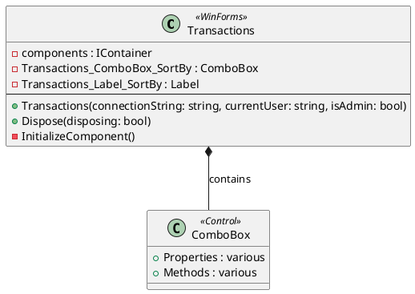

# DiagramGenerator

## Overview
The DiagramGenerator tool automatically creates PlantUML diagrams from C# source code. It generates both class diagrams showing form structure and dependency diagrams showing relationships between components.

## Usage

### Preview Mode (Recommended First)
```bash
dotnet run --project Tools/DiagramGenerator/DiagramGenerator.csproj -- --preview
```

### Execute Mode
```bash
dotnet run --project Tools/DiagramGenerator/DiagramGenerator.csproj
```

### Direct C# Execution
```csharp
var generator = new DiagramGenerator("Tools/DiagramGenerator/Logs", "Documents/Diagrams", previewMode: true);
generator.GenerateClassDiagram("Forms/Transactions/Transactions.cs", "Transactions");
generator.GenerateDependencyDiagram("Forms/Transactions/Transactions.cs", "Transactions");
generator.PrintSummary();
generator.SaveLog();
```

## Features

- **Class Diagrams**: Shows form structure with fields, methods, and control relationships
- **Dependency Diagrams**: Shows dependencies between forms, models, helpers, and data access classes
- **Preview Mode**: Shows what diagrams would be generated without creating files
- **Comprehensive Logging**: Creates detailed logs of all diagram generation
- **Automatic Detection**: Extracts information from source code automatically

## Diagram Types

### Class Diagrams
- Form class structure
- Control field declarations
- Method signatures
- Control type relationships
- Composition relationships

### Dependency Diagrams
- Using statements analysis
- Class dependencies
- Package relationships
- Data flow indicators

## Example Output

### Class Diagram Structure


### Dependency Diagram Structure

```puml
@startuml
!define FORM_STEREOTYPE <<Form>>
!define MODEL_STEREOTYPE <<Model>>
!define DAO_STEREOTYPE <<DAO>>

class "Transactions" FORM_STEREOTYPE {
    + Main functionality
}

class "Models" {
    + Functionality
}

"Transactions" --> "Models" : uses
@enduml
```


## Output

The tool generates:
1. **PlantUML Files**: `.puml` files saved to `Documents/Diagrams/`
2. **Console Output**: Real-time progress and summary
3. **Log Files**: Detailed logs saved to `Tools/DiagramGenerator/Logs/DiagramGenerator_Run_{timestamp}.log`

## Example Log Entry
```
[2025-01-13 10:30:45] Generated class diagram: Documents/Diagrams/Transactions_Class_Diagram.puml
[2025-01-13 10:30:45] Generated dependency diagram: Documents/Diagrams/Transactions_Dependency_Diagram.puml
```

## Safety Features

- **Preview Mode**: Test diagram generation before creating files
- **Automatic Directory Creation**: Creates output directories if they don't exist
- **Error Handling**: Graceful handling of missing source files
- **Detailed Logging**: Every operation is logged for review

## Analysis Capabilities

### Field Extraction
- Detects private, public, protected, and internal fields
- Identifies control declarations
- Extracts field types and names

### Method Extraction
- Identifies method signatures
- Detects constructors and regular methods
- Extracts accessibility modifiers

### Control Type Detection
- Parses `new System.Windows.Forms.ControlType()` patterns
- Identifies WinForms control types
- Creates control type definitions

### Dependency Analysis
- Parses using statements
- Identifies MTM_Inventory_Application namespace dependencies
- Extracts external dependencies

## Configuration

The tool can be extended by modifying the extraction methods:

```csharp
private List<string> ExtractFields(string content)
{
    // Add custom field extraction logic
    // Pattern matching for specific field types
    // Custom filtering and formatting
}
```

## Troubleshooting

### Common Issues

1. **Source File Not Found**: Ensure correct file paths
2. **Empty Diagrams**: Check if source files contain expected patterns
3. **Missing Dependencies**: Verify using statements are properly formatted

### Error Resolution

- **Pattern Matching Issues**: Review regex patterns for field/method extraction
- **Output Directory Problems**: Check permissions and path validity
- **PlantUML Syntax**: Validate generated diagrams with PlantUML tools

### Validation Steps

1. Run in preview mode first
2. Check generated `.puml` files with PlantUML viewer
3. Verify all expected elements are captured
4. Review log files for any warnings or errors

## Extension Points

### Custom Stereotypes
```csharp
diagram.AppendLine("!define CUSTOM_STEREOTYPE <<Custom>>");
```

### Additional Analysis
```csharp
private List<string> ExtractCustomElements(string content)
{
    // Custom parsing logic
    // Specific pattern matching
    // Domain-specific extraction
}
```

### Output Formats
- Currently generates PlantUML (`.puml`)
- Can be extended for other diagram formats
- Supports custom template systems

## Integration

### With Documentation
- Reference diagrams in documentation using ``
- Generate PNG/SVG from PlantUML files
- Embed in README files or wikis

### With CI/CD
- Automated diagram generation on code changes
- Validation of diagram completeness
- Integration with documentation systems

## Version History

- **v1.0**: Initial version with basic class and dependency diagrams
- **v1.1**: Added preview mode and comprehensive logging
- **v1.2**: Enhanced pattern matching and control type detection
- **v1.3**: Added dependency analysis and package relationships